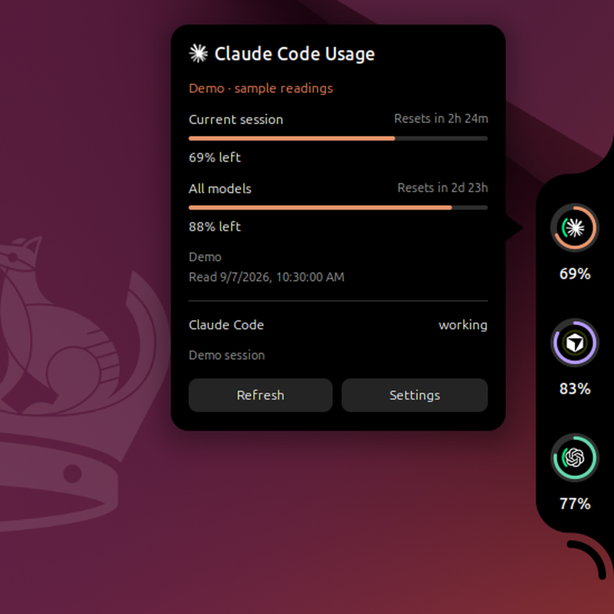
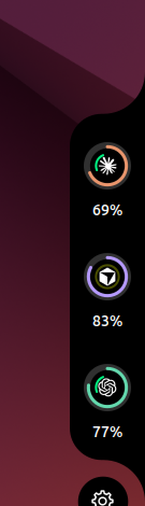

# CodeNotch for Ubuntu

Claude Code, Cursor, and Codex usage limits in a screen-edge notch for GNOME Shell. Hover the pill to unfold the rings. Hover or click a ring for reset times, window breakdowns, and session activity.



[Demo video (WebM)](docs/demo/demo.webm)

Independent MIT port of [Vinz's macOS CodeNotch](https://github.com/vinzdg/codenotch). Built for **Ubuntu 24.04** and **GNOME Shell 46**. Not an official upstream Linux release.

## Screenshots

| Collapsed handle | Unfolding | Detail popup | Settings gear |
| --- | --- | --- | --- |
|  |  |  |  |

Top-edge placement:


All shots use demo readings from `make smoke`. Your numbers come from your own accounts.

## Requirements

- Ubuntu 24.04 with GNOME Shell 46
- Python 3 and `glib-compile-schemas` (normally on Ubuntu Desktop)
- Node.js for building and tests only. The running extension does not need it.

## Install

```sh
git clone https://github.com/AfshinJalili/codenotch-ubuntu.git
cd codenotch-ubuntu
make install
```

Log out and back in, then enable the extension:

```sh
gnome-extensions enable codenotch@local
gnome-extensions prefs codenotch@local
```

The installer writes to your user data directory and backs up any existing install under `~/.local/share/codenotch/backups/`. It does not restart GNOME or enable the extension in your current session.

To build a zip you can share:

```sh
make package
```

Output: `dist/codenotch@local.shell-extension.zip`.

## Use

- Hover the narrow pill on any screen edge to expand it.
- Hover or click a ring for details. **Refresh** requests a new reading.
- Hover the curved line under the notch for the settings gear, or use keyboard focus. Pick an edge, a monitor, and whether rings stay expanded.
- **Super+Shift+U** opens and focuses the notch. Tab moves between buttons. Escape closes it.
- Turn on **Demo readings** in preferences to preview without credentials or network access.
- Disable a provider to stop reading it and drop its cache.

Percentages show **used** quota, not remaining. A dash means no reading. It never stands in for 0%. Dim rings and dated detail text mark stale readings.

An inner moving arc means activity. Amber means a session is waiting for you. Codex activity is an estimate from recent local writes and is labeled as such.

## Where readings come from

| Provider | Source |
| --- | --- |
| Claude Code | `~/.claude/.credentials.json` (or `CLAUDE_CONFIG_DIR`), then Claude's OAuth usage endpoint |
| Cursor | `$XDG_CONFIG_HOME/Cursor/User/globalStorage/state.vscdb`, opened read-only, then Cursor's usage-summary endpoint |
| Codex | Local `codex app-server` rate-limit request, with rollout fallback under `CODEX_HOME` (default `~/.codex`) |

The reader never signs in, refreshes credentials, or writes to another tool's files. Requests go to the owning vendor without following redirects. Sanitized cache and rate-limit backoff live under `$XDG_CACHE_HOME/codenotch` (default `~/.cache/codenotch`) with private permissions. Tokens are not cached or printed.

GNOME inherits your login environment, which may differ from a terminal. The reader checks `PATH`, `~/.local/bin/codex`, and common `~/.nvm` Node installs. Set `CODENOTCH_CODEX_BIN` in your login environment if Codex lives elsewhere. Changes apply after you log out and back in.

## Development

```sh
make test      # unit tests and schema compile; no account reads
make smoke     # headless GNOME with demo data; writes screenshots to .smoke/
make reload    # symlink this repo into ~/.local/.../extensions and re-enable
```

After you edit `extension.js`, run `make reload` on Wayland. You do not need to log out.

## Scope and limits

This port covers usage rings, hover details, four-edge placement, monitor selection, provider toggles, polling, stale states, rate-limit backoff, local session activity, and demo mode. It does not include multi-profile accounts or an automatic updater. Antigravity is intentionally excluded. Other desktops and GNOME versions are not supported by this package.

## Troubleshooting

```sh
python3 reader/codenotch_reader.py --providers codex,claude,cursor --demo
gnome-extensions info codenotch@local
journalctl --user -b -o cat | rg -i codenotch
```

For an expired credential, open the owning tool and use it normally, then hit Refresh. For an unavailable reader, check `/usr/bin/python3`. Network failures keep the last good reading as stale. Refresh does not bypass rate-limit backoff.

To disable:

```sh
gnome-extensions disable codenotch@local
```

To remove after disabling, delete `~/.local/share/gnome-shell/extensions/codenotch@local`. Optional cache: `~/.cache/codenotch`. Reset settings with `dconf reset -f /org/gnome/shell/extensions/codenotch/`.

## License

MIT. See [LICENSE](LICENSE). macOS CodeNotch by Vinz.
